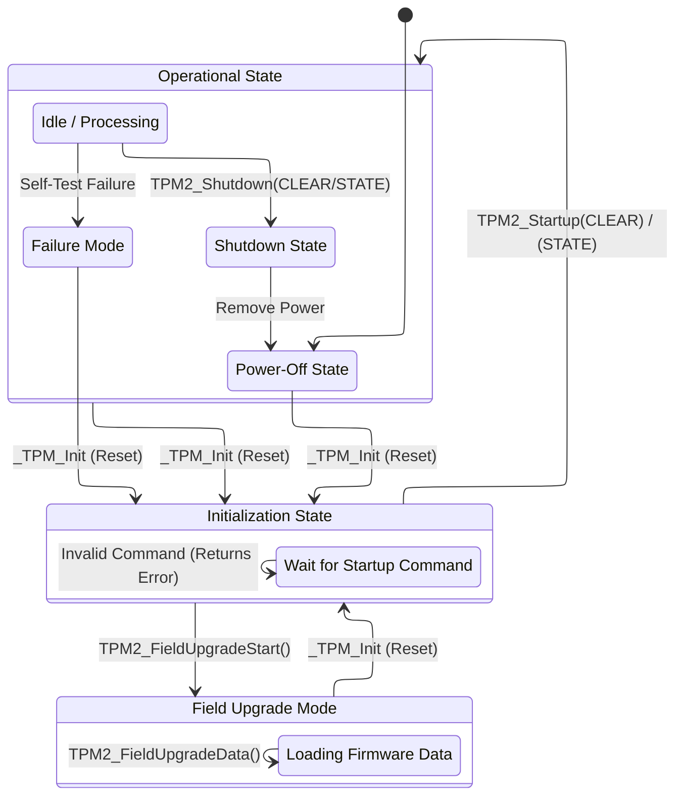

# TPM Operational States

The TPM operates through a defined set of states to ensure security and proper initialization. These states manage the transition from a powered-off condition to a fully operational mode where it can execute trusted commands.

## Overview of States and Transitions

### 1. Power-Off State

The TPM enters the **Power-off** state when power is removed or a reset is asserted.

* **Transitions:** The TPM can transition to this state from any other state unexpectedly due to power loss.
* **State Retention:** In a chaotic power-off, volatile data (RAM) is lost. To preserve state (such as keys or session contexts), the system must perform an orderly shutdown before power is removed.

### 2. Initialization State

This state begins when the TPM receives a platform-specific initialization indication (e.g., `_TPM_Init`). This usually coincides with the reset of the platform's Central Processing Unit (CPU), which acts as the Root of Trust for Measurement (RTM).

* **Actions:** The TPM performs basic internal initialization and validates firmware integrity.
* **Expected Commands:** The TPM waits for a specific startup command.
* **Normal Mode:** Expects `TPM2_Startup()`.
* **Field Upgrade Mode (FUM):** Expects `TPM2_FieldUpgradeData()`.

* **Errors:** If the first command received is not the expected one (e.g., a standard command instead of Startup), the TPM returns an error (`TPM_RC_INITIALIZE`) and remains in the Initialization state.

### 3. Startup State & Sequences

Once `TPM2_Startup()` is received, the TPM transitions from Initialization to an Operational state. The resulting state depends on how the TPM was previously shut down and the type of startup requested.

There are three primary startup sequences:

* **TPM Reset (`Startup(CLEAR)` after `Shutdown(CLEAR)` or Power Loss):**
* Analogous to a system reboot.
* Volatile state is cleared.
* Platform Configuration Registers (PCRs) and hierarchy controls are reset to defaults.
* Used when starting fresh or recovering from a crash.

* **TPM Restart (`Startup(CLEAR)` after `Shutdown(STATE)`):**
* Analogous to waking from hibernation.
* Restores saved state from the previous orderly shutdown (keys, sessions).
* **Crucially:** PCRs are *reset* to defaults to ensure the boot measurement chain is recorded fresh.

* **TPM Resume (`Startup(STATE)` after `Shutdown(STATE)`):**
* Analogous to waking from sleep (S3).
* Restores saved state *and* preserves specific PCRs (Resume PCRs).
* Allows the OS to resume exactly where it left off without re-measuring the boot sequence.

### 4. Operational State

In this state, the TPM is fully functional and accepts standard commands (e.g., creating keys, signing data).

* **Self-Tests:** The TPM may perform self-tests on algorithms. If a command requires an untested algorithm, the TPM runs the test first. If a test fails, the TPM enters **Failure Mode**.

### 5. Failure Mode

If the TPM fails a self-test or an internal integrity check, it enters **Failure Mode**.

* **Restrictions:** To prevent security breaches, the TPM blocks almost all commands. It returns `TPM_RC_FAILURE` for everything except diagnostic commands like `TPM2_GetTestResult()` and `TPM2_GetCapability()`.
* **Exit:** The only way to exit Failure Mode is to trigger a `_TPM_Init` (Reset).

### 6. Field Upgrade Mode (FUM)

This is a special mode for updating TPM firmware.

* **Entry:** Triggered by a successfully authorized `TPM2_FieldUpgradeStart()`.
* **Operation:** The TPM only accepts `TPM2_FieldUpgradeData()` to process firmware blocks.
* **Exit:** Once the upgrade is complete or abandoned, the TPM requires a reset to return to normal operation.

---

## State Machine Data Types and Constants

This section defines the data types, constants, and bit-field structures used by state transition commands
(`TPM2_Startup`, `TPM2_Shutdown`, `TPM2_SelfTest`) and by state inspection (`TPM2_GetCapability`).

### 1. Startup and Shutdown Types

These types are used directly as parameters for state transition commands.

#### TPM_SU (Startup Type)

This enumeration is the primary argument for `TPM2_Startup` and `TPM2_Shutdown`, dictating whether the
state transition is a reset (Clear) or a resume (State).

* **Type:** `UINT16`
* **Values:**
  * **`TPM_SU_CLEAR` (0x0000):**
    * On `TPM2_Shutdown`: Prepare for power loss and save state for a TPM Reset (discarding volatile state).
    * On `TPM2_Startup`: Perform a TPM Reset or Restart (initialize volatile state).
  * **`TPM_SU_STATE` (0x0001):**
    * On `TPM2_Shutdown`: Prepare for power loss and save state for a TPM Resume (preserving volatile state).
    * On `TPM2_Startup`: Restore state saved by `TPM2_Shutdown(TPM_SU_STATE)`.

### 2. State Attribute Structures

These bit-field structures are returned by `TPM2_GetCapability` and allow the host to inspect the internal
state of the TPM, including hierarchy enablement and shutdown status.

#### TPMA_STARTUP_CLEAR (Startup Attributes)

This structure reports hierarchy state and whether the previous shutdown was orderly. It is read using
`TPM_PT_STARTUP_CLEAR`.

* **Type:** `UINT32`
* **Key Bits:**
  * **Bit 0 (`phEnable`):** Platform hierarchy enabled.
  * **Bit 1 (`shEnable`):** Storage hierarchy enabled.
  * **Bit 2 (`ehEnable`):** Endorsement hierarchy enabled.
  * **Bit 4 (`readOnly`):** Read-only mode (all enabled hierarchies are read-only).
  * **Bit 31 (`orderly`):** Previous shutdown was orderly and matched by startup.

#### TPMA_PERMANENT (Permanent Attributes)

This structure reports persistent state flags that survive TPM Reset. It is read using `TPM_PT_PERMANENT`.

* **Type:** `UINT32`
* **Key Bits:**
  * **Bit 8 (`disableClear`):** `TPM2_Clear()` is disabled.
  * **Bit 9 (`inLockout`):** TPM is in DA lockout mode.

#### TPMA_MODES (TPM Modes)

This structure indicates specific operational modes, such as FIPS compliance.

* **Type:** `UINT32`
* **Key Bits:**
  * **Bit 0 (`FIPS_140_2`):** TPM is designed to comply with FIPS 140-2.

### 3. Property Tags (State Querying)

These constants are used as arguments for `TPM2_GetCapability` to select which structure to retrieve.

#### TPM_PT (Property Tag)

* **Type:** `UINT32`
* **Relevant Constants:**
  * **`TPM_PT_PERMANENT` (PT_VAR + 0):** Selects `TPMA_PERMANENT`.
  * **`TPM_PT_STARTUP_CLEAR` (PT_VAR + 1):** Selects `TPMA_STARTUP_CLEAR`.
  * **`TPM_PT_MODES` (PT_FIXED + 45):** Selects `TPMA_MODES`.

### 4. Critical Response Codes (State Indicators)

While standard response codes indicate success or failure, specific codes indicate the TPM's current state
machine status (e.g., uninitialized, failure mode, upgrade mode).

#### TPM_RC (Response Codes)

* **Type:** `UINT32`
* **State-Specific Values:**
  * **`TPM_RC_INITIALIZE` (0x100):** TPM not initialized (requires `TPM2_Startup`).
  * **`TPM_RC_FAILURE` (0x101):** TPM in Failure Mode (commands not accepted).
  * **`TPM_RC_UPGRADE` (0x12D):** TPM in Field Upgrade Mode.
  * **`TPM_RC_REBOOT` (0x130):** `_TPM_Init` and `TPM2_Startup(CLEAR)` required before resume.
  * **`TPM_RC_READ_ONLY` (0x156):** Command failed because TPM is in Read-Only mode.
  * **`TPM_RC_NV_UNINITIALIZED` (0x14A):** `TPM2_Startup(STATE)` failed to restore saved state.

### 5. Helper Types

These types are used in self-testing and command handling.

#### TPMI_YES_NO

Used in `TPM2_SelfTest` to specify full or incremental testing.

* **Type:** `BYTE`
* **Values:**
  * **`NO` (0):** Perform incremental self-test.
  * **`YES` (1):** Perform full self-test.

#### TPM_CC (Command Codes)

Unique identifiers for the commands used to manipulate the state machine.

* **Type:** `UINT32`
* **Relevant Values:**
  * `TPM_CC_Startup` (0x00000144)
  * `TPM_CC_Shutdown` (0x00000145)
  * `TPM_CC_SelfTest` (0x00000143)
  * `TPM_CC_GetTestResult` (0x0000017C)
  * `TPM_CC_GetCapability` (0x0000017A)
  * `TPM_CC_FieldUpgradeStart` (0x0000012F)
  * `TPM_CC_FieldUpgradeData` (0x00000141)

---

### TPM State Machine Diagram

The following diagram illustrates the relationships between these states and the commands that trigger transitions.

### Key Concepts from the Diagram

* **The Checkpoint:** The `Initialization` state acts as a gatekeeper. The TPM does not become usable until software explicitly tells it how to configure itself via `TPM2_Startup`.
* **The Trap:** `Failure Mode` is a "trap" state. Once entered, the TPM refuses to perform work until the hardware is reset, ensuring a compromised device does not process sensitive data.
* **The Cycle:** The `Shutdown` -> `PowerOff` -> `Init` -> `Startup` cycle allows the TPM to persist state (like keys loaded in RAM) across system power cycles, which is essential for "Sleep" and "Hibernate" power features in modern OSs.
